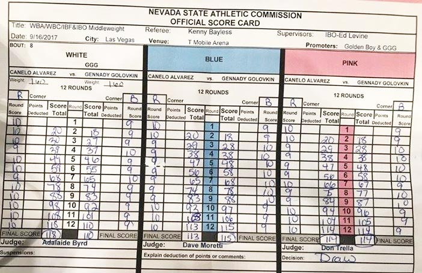
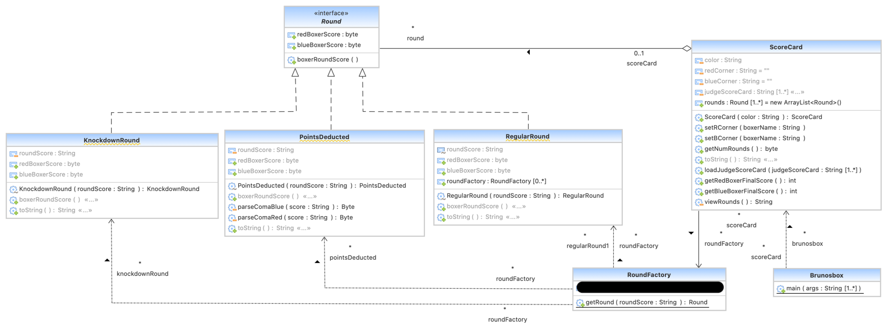

Frank Bruno's Boxing
====================
## Solucion del examén de Contornos de desarrollo DAW Dual de la segunda evaluación.

### **Autor:** Brais Bea Mascato
### **Lugar:** IES de Teis, Vigo.
### **Año:** 2024.

La descripción del programa a diseñar partiendo del diagrama UML se detalla a continuación.


## En el ring

### ¿Cómo se puntua un combate de boxeo?



En un combate de boxeo, hay tres jueces/zas sentados al lado del ring.

Cada uno de ellos/as rellena una tarjeta de puntos. En este caso: blanca, azul y rosa.

El actual sistema de puntuación del boxeo se conoce como "Sistema obligatorio de 10 puntos". 

Esta es una descripción general básica de cómo funciona:

- Los jueces califican cada asalto individualmente en una escala de 10 puntos. La mayoría de asaltos se califican `10-9`, con el boxeador/a que lo hizo mejor puntuando `10` y "ganando" el asalto, y el otro boxeador/a puntuando `9`.
- Si un boxeador es derribado o lastimado lo suficiente como para que el árbitro cuente de pie, ese boxeador pierde un punto. Si un púgil domina un asalto, controla y lanza mejores golpes en todo momento y también derriba a su oponente, el resultado final del asalto es `10-8`.
- El /la árbitro puede indicar a los tres jueces/zas que resten un punto a un púgil en cualquier asalto. Lo harán si éste ha hecho algo para romper las reglas, como una falta intencionada (golpe bajo, cabezazo, o el favorito de Mike Tyson, morder la oreja de un oponente).

### Resultado de la pelea.

Si nadie ha ganado por _knockout_ después del número programado de asaltos (pueden ser 10 o 12 asaltos), las tarjetas de puntuación de los jueces -asalto por asalto a lo largo de la pelea- determinarán el ganador/a.

Cada uno de los tres jueces/zas tendrá un ganador/a general o pueden puntuar la pelea empatada.

- Decisión unánime: los tres jueces tienen al mismo boxeador líder en sus tarjetas de puntuación.
- Decisión dividida: dos jueces tienen al Boxeador A primero, mientras que un juez tiene al Boxeador B líder. Eso significa que el Boxeador A gana, dos tarjetas de puntuación a una.
- Decisión de la mayoría: dos jueces tienen un peleador por delante, mientras que el tercer juez lo puntúa como empate. El boxeador ganador no obtuvo una decisión unánime, pero se llevó la mayoría de las puntuaciones.
- Empate: si un juez tiene al boxeador A por delante, un juez tiene al boxeador B por delante y el tercero lo ha puntuado como empate, el resultado general es un empate (también conocido como "empate dividido"). Por supuesto, si los tres jueces terminaron empatados, también es un empate (un 'empate unánime').
- Empate mayoritario: si dos de los tres jueces tienen una pelea igualada pero el tercer juez tenía al boxeador A por delante, una ventaja tan pequeña no es suficiente para que el boxeador A sea declarado ganador. En cambio, se declara un 'sorteo mayoritario'.


## Salida de la aplicación

Intenta que la salida del programa por CLI sea lo más parecida posible a las imágenes que se proporcionan. Cada una de ellas se corresponde con una de las historias de usuario que se detallan en los epígrafes siguientes.


## Historias de usuario /casos de uso

Las historias de usuario están enunciadas en el script principal `Brunosbox.java`.

## Diagrama de clases UML / Arquitectura de la app.

Sigue el diagrama de clase UML proporcionado para construir la aplicación.

AÑADE AL DIAGRAMA DE CLASES (junto a sus relaciones con el resto de clases) el componente .



## Prepara el proyecto

 1. Crea un nuevo repo PRIVADO en tu cuenta en **Github** y compártelo con el usuario dfleta.
 2. Crea un nuevo directorio en tu equipo y **clona el repositorio** de Github.
 3. Abre VSCode /Eclipse /Netbeans /IntelIJ y **establece como workspace** el directorio que has clonado.
 4. Crea un proyecto **Gradle** o **Maven**.
 5. Pon el proyecto en seguimiento en **Git** y configura `.gitignore`.
 6. Copia y pega la función principal `Brunosbox.java`. Utilízala como guía en el proceso TDD. **Modificar su código sólo en las líneas que se indiquen**. Sí puedes comentar aquellas partes que aun no hayas implementado.
 7. Completa las clases que aquí se indican **implementando los casos test que necesites**. Practica **TDD**.
 8. **Realiza `commits` como mínimo cada vez que termines una historia de usuario**. Sin commit periódicos, no corrijo el examen.


 ## Cómo entregar el código

 1. Crea un repo PRIVADO en tu GitHub y compártelo con el usuario dfleta.
 2. **Realiza commits periódicamente** mientras avanzas en el desarrollo de la aplicación. Sin commit periódicos, no corrijo el examen.
 3. Realiza un `push` al repo remoto en GitHub **SOLO cuando hayas terminado el proyecto**.
 3. Si quieres, si vas a dormir mejor, desde Eclipse /Netbeans /IntelIJ exporta el proyecto a un fichero. En VSCode, comprime en un ZIP la carpeta del proyecto. Envíame el archivo ZIP por correo electrónico. **No se admiten ficheros .rar**.


### Dependencia ASCII Table.

Incluye la dependencia al paquete [ASCII Table](https://mvnrepository.com/artifact/com.github.freva/ascii-table):

https://mvnrepository.com/artifact/com.github.freva/ascii-table

### Crea el fichero `jar` ejecutable.

#### Maven

Configura el _plugin_ `jar` para generar un fichero `jar` **ejecutable** con la clase principal `Brunosbox.java`.

Además, tendrás que incluir el siguiente _plugin_ en el archivo de configuración del proyecto.

```xml
        <!-- mvn clean compile assembly:single -->
        <plugin>
          <artifactId>maven-assembly-plugin</artifactId>
          <configuration>
            <archive>
              <manifest>
                <mainClass>edu.badpals.brunosbox.Brunosbox</mainClass>
              </manifest>
            </archive>
            <descriptorRefs>
              <descriptorRef>jar-with-dependencies</descriptorRef>
            </descriptorRefs>
          </configuration>
          <executions>
            <execution>
              <id>make-assembly</id>
              <phase>package</phase> <!-- bind to the packaging phase -->
              <goals>
                <goal>single</goal>
              </goals>
            </execution>
          </executions>
        </plugin>
```

Genera el fichero `jar` desde línea de comandos:

`mvn clean compile assembly:single`

Obtendrás en el directorio `target` un fichero llamado:

`artifactId-1.0-SNAPSHOT-jar-with-dependencies.jar`


#### Gradle

Configura la _task_ `jar` para generar un fichero `jar` **ejecutable** con la clase principal `Brunosbox.java`.

Además, tendrás que incluir la siguiente _tarea_ en el archivo de configuración del proyecto.

```groovy
// construir con: gradle fatJar
// build/libs/brunosbox-1.0-SNAPSHOT.jar
task fatJar(type: Jar) {
    manifest {
        attributes 'Main-Class': 'edu.badpals.brunosbox.Brunosbox'
    }
    duplicatesStrategy = DuplicatesStrategy.INCLUDE
    from { configurations.compileClasspath.collect { it.isDirectory() ? it : zipTree(it) } }
    with jar
}
```

Genera el fichero `jar` desde línea de comandos:

`gradle fatJar`

Obtendrás en el directorio `build/libs` un fichero llamado:

`brunosbox-1.0-SNAPSHOT.jar
`

#### Salida por consola

Ejecuta este fichero `jar` desde la CLI (línea de comandos).

Debes obtener en consola una salida como esta, la representación en ASCII Art de una tarjeta con la puntuación de una partida de bolos.

```
- I see three of them out there.
 - Hit the one in the middle.- Rocky Balboa

+---------+---------+---------+-----------+---------+-----------+---------+---------+---------+----------+
| Round 1 | Round 2 | Round 3 | Round 4   | Round 5 | Round 6   | Round 7 | Round 8 | Round 9 | Round 10 |
+---------+---------+---------+-----------+---------+-----------+---------+---------+---------+----------+
|  9 - 10 |  9 - 10 |  9 - 10 |    9 - 10 |  10 - 9 |    10 - 9 |  10 - 9 |  9 - 10 |  10 - 9 |   9 - 10 |
+---------+---------+---------+-----------+---------+-----------+---------+---------+---------+----------+
|  9 - 10 |  9 - 10 |  9 - 10 |    8 - 10 |  10 - 8 |    10 - 8 |  10 - 9 |  9 - 10 |  10 - 9 |   10 - 9 |
+---------+---------+---------+-----------+---------+-----------+---------+---------+---------+----------+
|  9 - 10 |  9 - 10 |  9 - 10 | 1, 8 - 10 |  10 - 8 | 10 - 8 ,1 |  10 - 9 |  9 - 10 |  10 - 9 |   10 - 8 |
+---------+---------+---------+-----------+---------+-----------+---------+---------+---------+----------+
```
